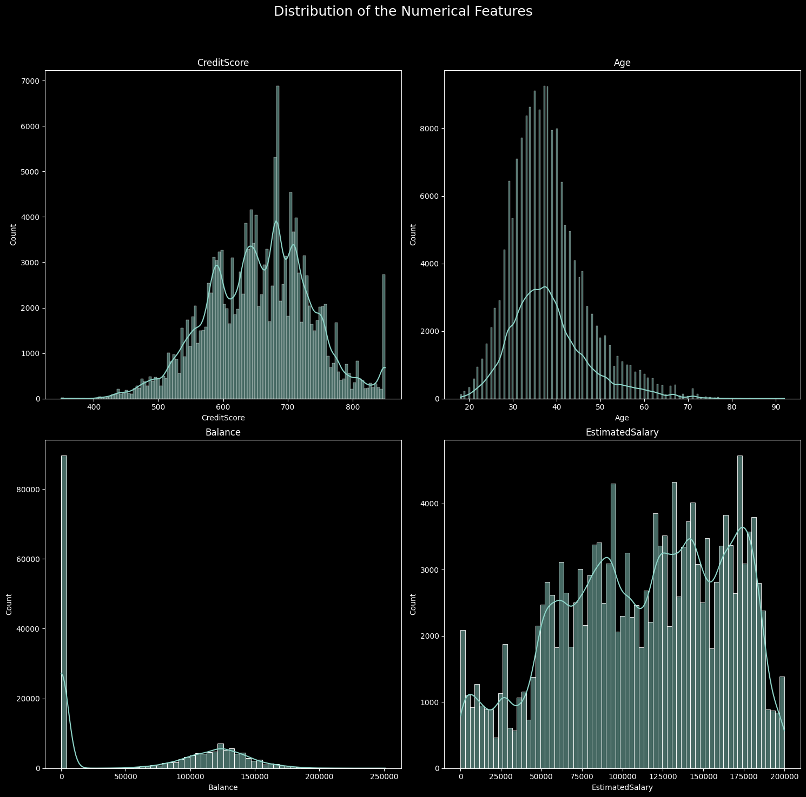
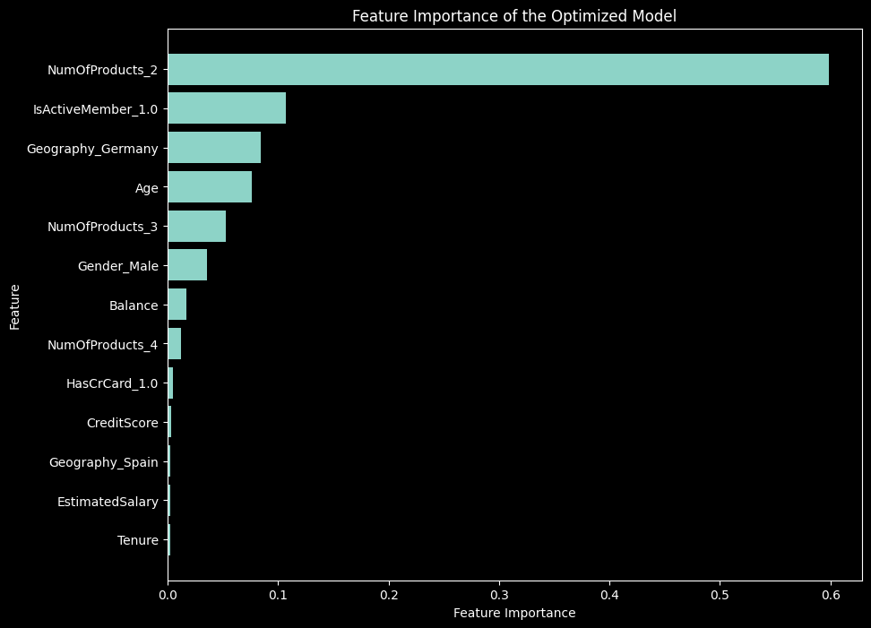
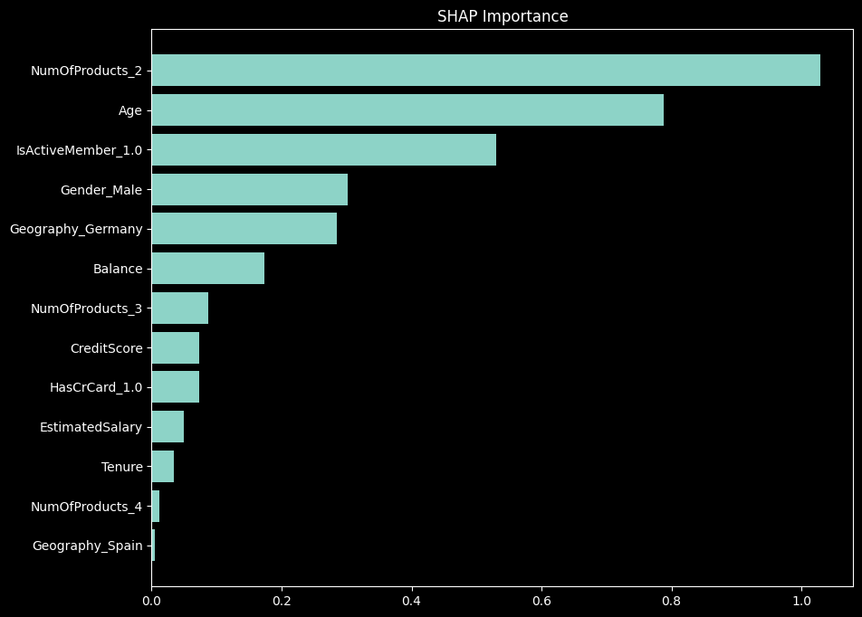

## **Churn Prediction Model in Banking Report**

*The Jupyter Notebook for data exploration: [here](https://github.com/analytics-portfolio/Churn-Predictive-Model/blob/main/notebooks/data_exploration.ipynb)*,
*The Jupyter Notebook for machine learning models: [here](https://github.com/analytics-portfolio/Churn-Predictive-Model/blob/main/notebooks/ml.ipynb)*

### **🌐 Project Summary**
#### **🎯 The Problem & The Objectives**: 
In the banking industry, the customer churn problem (customer stops using the bank service) is a significant problem: it directly impacts a bank's profitability. Churn customers result in lost revenue, increase in acquisition costs, and many other negative implications. Solving the churn problem is crucial for banks to maintain a stable customer base and improve the business' bottom lines.

The objective is to build a predictive model to accurately predict if a customer would churn. The data used to build the models are customer personal data and their financial profiles. The original competition as well as the original dataset can be found [here](https://www.kaggle.com/competitions/playground-series-s4e1). 

The key metric in this competition is the [Area Under the ROC Curve (AUC-ROC)](http://en.wikipedia.org/wiki/Receiver_operating_characteristic). This metric provides a comprehensive measure of the model's ability to discriminate between the positive (churn customers) and negative (non-churn customers) groups. The goal is to achieve the highest possible AUC-ROC score.

Another important metric in the customer churn problem is **Recall**. Recall measures the proportion of actual churn customers correctly identified by the model out of all the customers who actually churn. High recall means your model is effective at catching most of the customers who are at risk of churning, minimizing the number of customers who churn without being identified.

#### **🌟 The Key Findings & Results**: 
- **Achieved a 0.88-0.89/1 AUC (top 1% Kaggle competition leaderboard).**
- **Increased the Recall metric from 55% to 84%.** This means for every 100 customers who will churn, the model will correctly identify 80 of them, increasing the chance to keep the customer to stay. 
- **Visualize decision-making process with decision tree graph**, showing how the model makes step-by-step decisions (model interpretability). 
- **Quantify the the most significant factors of customer churn prediction**, which are *the number of products used by customers, the customer's active member status, and customer's geographic location.*

### **🔍 Methodology**
- **Exploratory Data Analysis**: We address anomalies, discover data pattern, understand feature distributions, and spot correlations between variables. We then proceed to visualize the data using various charts such as histograms for distribution analysis, box plots for detecting outliers, and scatter plots and heatmaps for observing relationships between features.

- **Data Preparing for Training Model**: In this step, we perform handle missing values, encode categorical variables, and select feature, ensuring that our models are fed with clean and relevant data for optimal performance.

- **Building Baseline Model Results**: We first build a baseline (without any optimization) XGBoost classifier. In the next step, we fine-tune the classifier's hyperparameter by gridsearch method. 

- **Tuning Hyperparameter & Cross Validation:** The process of hyperparameter tuning and cross-validation is aimed at enhancing the model's ability to generalize to unseen data, thus improving its predictive performance. 
We employ a grid search strategy to systematically explore the hyperparameter space, such as learning rate, max depth of trees, and regularization terms. This approach ensures that we identify the optimal combination of parameters that yields the best performance, as measured by the Area Under the ROC Curve (AUC-ROC) on a validation set.

- **Model Interpretation**: Model interpretation focuses on understanding the decisions made by our tuned XGBoost classifier. We explore feature importance scores to identify which variables most significantly influence customer churn decision.

**Feature Importance Graph** This graph provides a visual representation of the relative importance of each feature in predicting the target variable in a machine learning model. It ranks features based on their impact on the model’s predictions. Feature importance graphs give a high-level overview of the features that model deems important overall

**SHAP Importance Graph**: SHAP shows how each feature affects the prediction for *individual instances*, as well as on average across the dataset.

SHAP importance graphs offer deep, instance-level insights into how and why specific features drive the model’s predictions, highlighting their impact on individual predictions in a way that aligns with human intuition and reasoning.

For the detailed steps and code, please refer to the file `notebook/ml.ipynb` or [click here](https://github.com/analytics-portfolio/Churn-Predictive-Model/blob/main/notebooks/ml.ipynb).
